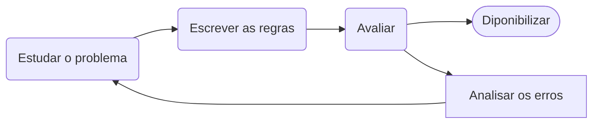
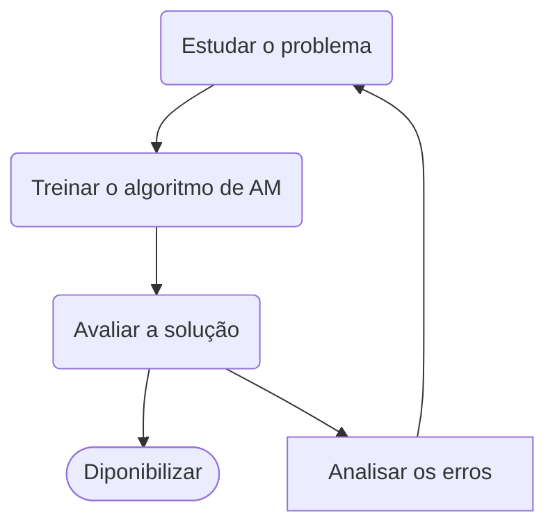

## Capítulo 1 : O Cenário do aprendizado de máquina

   Há algumas décadas o Aprendizados de Máquina foi introduzido como reconhecimendo ótico de caracteres em algums aplicativos especificos, mas o primeiro  aplicativo que realmente se popularizou e conquistou o mundo na década de 1990. O **filtro de spam** , foi seguido por centenas de aplicativos AM que agora , silenciosamente , integram centenas de produtos e funcionalidades de recomendações de busca por voz , que são utilizados frequentemente.

### 1.1 - O que é Aprendizado de Máquina?

* "Aprendizado de Máquina é o campo de estudo que possibilita aos computadores a habilidade de aprender sem explicitamente programa-los"

* Para engenharia:
  
  * "Alega-se que um programa de um computador aprender pela experiencia E em relação a algum tipo de tarefa T , e alguma medida de desempenho P se o seu desempenho em T ,conforme medida por P, melhora a com a experiencia E"
    
    * Tarefa T: novos dados
    
    * Experiencia E: dados de treinamento
    
    * Desempenho P: medidas de desempenho (ex.acurácia)

&nbsp;

### 1.2 - Por que usar o Aprendizado de Máquina

#### Nua abordagem tradicional:

1. Primeiro , estudar o problema com isso idenficando os padrões do problema que deseja solucionar

2. Escrever o algoritmo de detecção do problema para cada um dos padrões identificados

3. Repetir os passos 1 e 2 até obter um bom desempenho****
* **Contras:**
  
  * Alta manutenção para problemas complexos 
  
  * Dificil para mudanças
  
  * Complexidade

#### Nua abordagem de Aprendizado de Máquina:

* Tecnicas de aprendizado de máquina são capazes de indetificar os padrões assim sendo o programa bem menor, facil manutenção e mais preciso , além disso se adapta melhor a mudança.

* Algortimos de aprendizado de máquina geralmente simplifica e tem um melhor desempenho do que a abordagem tradicional

* Adaptabilidade de ambientes

* Entendimento de problemas complexo e grander quantidades de dados

&nbsp;

### 1.3 - Tipos  de Sistema de Aprendizado de Máquina:

#### Supervisionado

O conjunto de treinamento que voce fornece ao algoritmo inclui as soluções desejadas , rótulos 

* Classificação : classificação algum rotulo

* Regressão : previsão de um atributo alvo `target`

> **Rótulos :** São informações de saida associada aos dados. Ela representa a resposta desejada ou categoria a qual um exemplo pertence
> 
> ex : classe TipoDeEmail : SPAM OU NÃO SPAM 
> 
> &nbsp;
> 
> **Target :** Refere-se a variavel dependente que está sendo prevista
> 
> ex : atributo numerico PreçoDeImoveis 

**Algoritmos :**

1. Regressão Linear

2. Regressão Logistica

3. Knn

4. Redes Neurais

5. Arvores de decisão e floresta aleatoria

6. Máquina de vertores de suporte

#### Não-supervisionado

O conjunto de dados que voce fonce ao algoritmo inclui dados não rotulados.

* Clusterização

* Detecção de anomalias e de novidades

* Visualização e redução de dimensionalidade
  
  * Redução de dimensionalidade o objetivo é simplicar os dados sem perda de informação , por exemplo, um atributo quilometragem de um carro esta altamente correlacionada com seu tempo de uso. Dessa forma o algoritmo de aprendizado da redução da dimensionalidade fará um merge em caracteristicas nesse atributos que irá representar o desgaste do carro.(Sem chama de extração de caracteristicas).
    
    * E bom fazer utilizar esse algoritmo e fornece-lo a outro algoritmo de aprendizado de maquina supervionado

* Aprendizado por regra por associação
  
  * o objetivo é investigar grandes quantidade de dados e descobrir relações interessantes entre os atributos
  
  

#### Semissupervisionado

Vai utilizar geralmente tando o aprendizado de maquina supervisionado e não supervisionado

##### Aprendizado por esforço

* O Sistema de aprendizado , pode assistir o ambiente , selecionar e executar ações e obter recompensas em troca ou penalidades afim de aprender sozinho a melhor estrategia(chamada politica),para obter o maior número de recompensa ao longo do tempo.

#### Aprendizado em batch(por ciclo)

* O sistema e incapaz de aprender de forma incremental: ele deve ser treinado usando todos os dados disponiveis. 

* O modelo é treinado em um conjunto de dados completo de uma só vez.

* Caso queira uma novos dados é preciso  de um nova  versão apartir do zero no conjunto completo de dados(com os dados antigos e novos) e descontinuar o sistema antigo e implementar o novo.

#### Aprendizado Incremental

* No aprendizado online, o modelo é atualizado incrementalmente à medida que novos dados chegam.

* Excelento para sistema que recebem dados de fluxo continuo e precisam se adaptar a mudanças rápido ou autonomamente

&nbsp;

### 1.4 -  Principais desafios do Aprendizado de Máquina

1. **Quantidade de dados insuficiente para treinamento**

2. **Dados de treinamento não representativos**

3. **Dados de baixa qualidade**

4. **Caracteristicas Irrelevantes**

5. **Sobreajuste dos dados de treinamento(Overfiting)**
   
   * Situação em que um modelo se ajusta muito bem aos dados de treinamento, mas tem um desempenho ruim na generalização para dados não vistos, ou seja, em dados de teste ou em situações do mundo real. 
   
   * **Causas:**
     
     * Modelos Complexos
     
     * Tamanho Pequeno do Conjunto de Treinamento:
     
     * Ruído nos Dados
   
   * **Soluções:**
     
     * Simplificar o modelo ao selecionar um com menos parametros, reduzindo o números de atributos  nos dados de treinamento 
     
     * Coletar mais dados de treinamento
     
     * Reduzir o ruídos nos dados de treinamento

6. **Subajuste dos dados de treinamento(Underfiting)**
   
   * E ocorre quando um modelo é muito simples para capturar os padrões nos dados de treinamento
   
   * **Soluções**
     
     * Selecionar modelos mais poderoso , com mais parametros
     
     * Alimentar o algoritmo de aprendizado com melhores caracteristicas
     
     * Minimizar as restrições do modelo
     
     

----------
