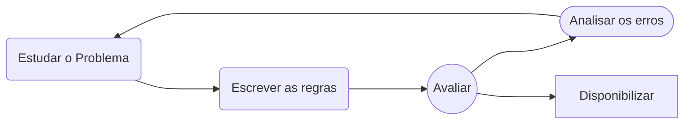
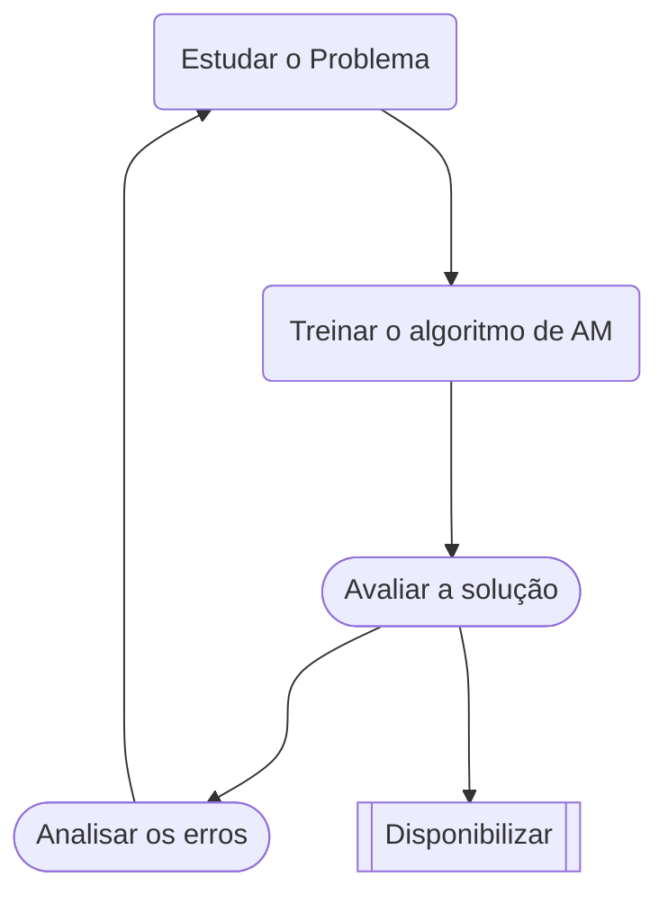
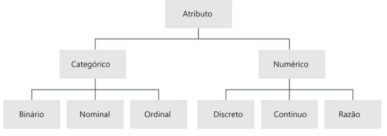
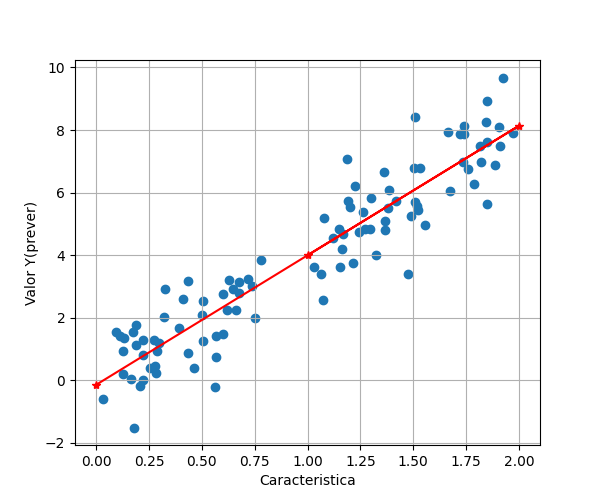

# Capítulo 1 - Cenário do Aprendizado de Máquina

Primeiro Algoritmo de Aprendizado de Máquina que se popularizou na década de 1999 , o foi *filtro de Spam* 

## 1.1 - O que é aprendizado de máquina?

* "Aprendizado de máquina é o campo de estudo que possibilita aos computadores a habilidade de de aprender sem explicitamente programa-los" , Arthur Samuel ,1959

## 1.2 - Por que usar Aprendizado de Máquina ?



##### **Desenvolvendo um filtro de spam nua abordagem tradicional**

1. Identificar as carecteristicas do spam, observando os padrões 

2. Escrever um algoritmo de detecção de spam para cada um dos padrões observados

3. Repertir o passos 1 e 2 até obter um bom desempenho

**Contras** :

* Se o problema for muito complexo o algoritmo também se tornará complexo, além disso tornando a manutenção do mesmo custosa e nada fácil



##### Nua abordagem do aprendizado de máquina

1. Um filtro de spam baseado em técnicas de aprendizado de máquina aprende automaticamente quais são os padrões e bom indicadores de spam 

**Vantagem a abordagem tradicional** : 

* Programe bem menor 
* Fácil manutenção
* Adaptabilidade de ambientes : sistema de aprendizado de maquina podem se adaptar a novos dados

## 1.3 - Tipos de Aprendizado de Máquina

* Serem ou não treinado com supervisão visão humana

* Se podem ou não aprender gradativamente em tempo real

* Se funcionam simplesmente comparando novos pontos de dados com dados conhecidos, ou se detectam padrões em dados de treinamento

### Aprendizado Supervisionado

O conjunto de treinamento que você fornece ao algoritmo inclui as soluções desejadas , chamadas de rotulos

* **Classificação**

* **Regressão**
  
  * Prever valor numéricos alvo [**target**], dado um conjunto de caracteristicas [**features**]

> São informações em um conjunto de dados que têm rótulos ou categorias associadas a eles. Cada instância ou amostra de dados em um conjunto rotulado é acompanhada por uma etiqueta ou categoria que descreve ou classifica essa amostra.

### Aprendizado Não Supervisionado

Os dados da treinamento não são rotulados,os sistema tenta aprender sem um professor

* **Clusterização** 
  
  * é uma técnica em que o algoritmo tenta dividir o conjunto de dados em grupos ou clusters, com base em características similares

* **Detecção de anomalias ou novidades**

* **Visualização** 

* **redução de dimensionalidade**
  
  * É simplificar os dados sem perder muita informação. Para tal,voce pode fazer um merge de diversas características correlacionadas em uma

* **Aprendizado de regras por associação**
  
  * É descobrir relações interessante entre atributos
  
  * Este tipo de aprendizado visa encontrar padrões que indicam relações entre variáveis no conjunto de dados.

> São conjuntos de informações em que as amostras não possuem categorias, etiquetas ou rótulos associados a elas. Esses dados consistem em observações brutas ou não classificadas, não sendo explicitamente categorizados ou identificados.

### Aprendizado semissupervisionado

São combinações de aprendizado supervisionado e não supervisionado

### Aprendizado por esforço

O sistema de aprendizado ,chamado de agente nesse contexto , pode assistir , selecionar e executar ações e obter recompensas em troca. Ele deve aprender sozinho qual e melhor estrategia (politica) para obter maior recompensas ao longo do tempo.

### Aprendizado em bach(por ciclo)

O sistema e capaz de aprender de forma incremental : deve ser treinado com todos dos dados disponíveis. O sistema e treinado , depois colocado em produção e roda sem aprender mais nada, só o  que aprendeu.

**Contras** :

* Se o for atualizar o sistema e preciso usar os dados novos e antigos para treina-los e disponibilizar, com isso pode ser computacionalmente caro se do dados forem grandes para cada atualização

### Aprendizado Online(incremental)

É possivel treinar o sistema incrementalmente , fornecendo as instancia de forma sequancial ,individual ou em pequenos grupos 

### Aprendizado baseado em instancia

O sistema aprende os exemplos por meio da memorização e depois generaliza em novos casos , ao empregar ma medida de similaridade a fim de compara-lo aos outros exemplos aprendidos 

### Aprendizado baseado em modelo

Enfatiza a utilização de casos específicos (exemplos) como base para fazer previsões. Os casos são compostos por instâncias (entradas) e as ações ou decisões associadas a essas instâncias. O sistema aprende a adaptar as decisões com base nos casos históricos.

## Principais desafios do aprendizado de máquina

### Sobreajuste(Overfiting)

Significa que o modelo funciona bem nos dados de treinamento , mas não generaliza tão bem

* Acontece quando o modelo é muito complexo em relação á quantidade e ao ruído dos dados de treinamento , soluções:
  
  1. Simplificar o modelo ao selecionar um com menos parametros, reduzindo o número de atributos nos dados de treinamento ou retringindo o modelo
  
  2. Coletar mais dados de treinamento
  
  3. Reduzir o Ruído nos dados de treinamento(remover outliers e corrigir error de outliers)

&nbsp;

&nbsp;

-------------------

# Capítulo 2 - Projeto de Aprendizado de Máquina Ponta a Ponta

## 2.1 - Checklist do Projeto :

1. Abordar o problema e analisar o panorama em geral

2. Obter os dados

3. Explorar os dados 

4. Preparar os dados para expor melhor os padrões de dados subjacentes aos algoritmos de aprendizado de máquina

5. Explorar muitos modelos diferentes e os combinar com a melhor solução

6. Apresentar sua solução

7. Implementar , monitoriar e fazer manutenção

## 2.2 - Pipeline :

A seguencia de compenentes de processamentos de dados se chama pipeline de dados. 

## 2.3 - Medida de desempenho :

* **Erro quadrático médio :** Calcula a média dos quadrados das diferenças entre as previsões e os valores reais.
  
  * $\large RMSE(X,h) = \sqrt{\frac{1}{m} \sum^{m}_{i=1}{(h(x^{(i)}) - y^{(i)})}} $
    
    * **Pros**
      * Penaliza erros grandes mais fortemente 
      * Penaliza valores distante da média
    * **Contras**
      * Menos intuitivo, os valores estão ao quadrado, o que pode torná-lo mais sensível a outliers extremos.

* **Erro Absoluto médio :** Calcula a média das diferenças absolutas entre as previsões e os valores reais.
  
  * $\large MAE(X,h) = \frac{1}{m} \cdot \sum^{m}_{i=1} | (h(x^{(i)}) - y^{(i)})|$
    
    * **Pros**
      * Fácil interpretação, trata todos os erros de forma igual.
    * **Contras** 
      * Não tem penalidade 

* **R2** : . Quanto mais próximo o R2 estiver de 1, melhor o modelo está em explicar a variabilidade nos dados. Se R2 for próximo de 0, o modelo não está explicando bem a variabilidade nos dados.
  
  * $\large R2(pred,ytrue) = 1-\frac{\sum^{m}_{i=1}({ytrue^{i} - pred^{i})^{2}}}{ {\sum^{m}_{i=1}} ({ytrue^{i} - ytrue_{mean})^{2}} }$

## 2.3 - Tipos de atributos



- **Atributo categórico binário**: é aquele que assumi apenas dois valores, e podem ser *também númericos*
  
  - ex : atributo "gender"" possui dois valores únicos = ['female' , ' male'].

- **Atributo categórico Nominal** : é aquele cujos valores possuem símbolos ou rótulos distintos.
  
  - Por exemplo: o atributo “estado civil” pode assumir os valores [“solteiro”,“casado”, “separado”, “divorciado”,“viúvo”].

- **Atributo categórico ordinal :** é aquele que permite ordenar suas categorias, embora não necessariamente haja uma noção explicita de distância entre as categorias
  
  - Por exemplo: o atributo “nível educacional” pode assumir
    os valores [“primário”, “secundário”, “graduação”,“especialização”,“mes trado”,“doutorado”]

- **Atributo numérico de razão(Intervalar)** : Elas têm os mesmos atributos das variáveis contínuas, mas possuem uma escala definida, onde as diferenças entre os valores são interpretáveis e significativas.

- **Atributo Numérico Discreto :** Elas assumem valores específicos e separados, e não podem ter valores intermediários entre esses valores.(geralmente são inteiros)
  
  - Número de filhos em uma família (1, 2, 3...)

## 2.3 - Tail Heavy:

Na analise dados , com histograma podemos vizualizar que certo atributos podem ter uma tail-heavy, as vezes se faz necessario passar para um distribuiçao normal

* Logaritmica
  
  * ```python
    import numpy as np
    target = np.log10(target)
    ```

* Raiz Quadrada
  
  * ```python
    import numpy as np
    values = np.sqrt(values)
    ```

* Box-cox
  
  * ```python
    from scipy.stats import boxcox
    ```

## 2.4 - Conjunto de test

#### Amostragem estratificada

* Supondo que Eua e formado por 51% de mulheres e 49% de homens , uma pesquisa e feita e mantem essa proporção na amostragem, **amostragem estratificada** a população e dividida em subgrupos homogeneos, chamados de estratos, e recolhe-se a amostra do numero certo de instancia de cada estrato, afim de garantir que o conjunto de test represente população como um todo.

## 2.5 - Prepare os dados para o algoritmos de Machine Learning

Em vez de preparar tudo manualmente , voce dever escrever funções 

1. Reutilizavel

&nbsp;

&nbsp;

---------------------------

# Capítulo 4 - Treinando Modelos

## Regressão Linear


