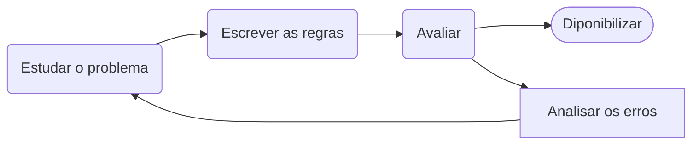
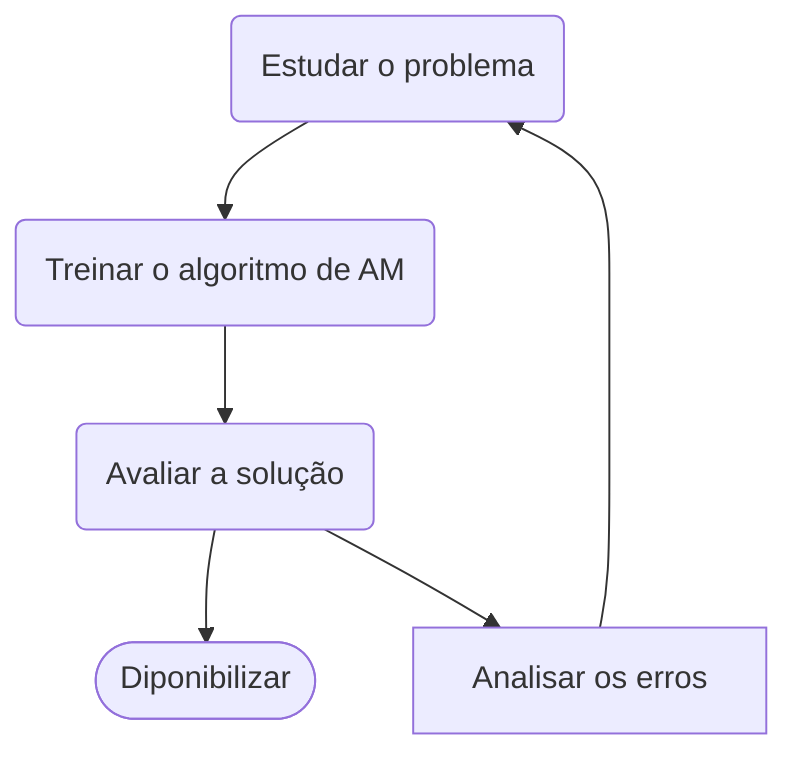

# Capítulo 1 : O Cenário do aprendizado de máquina

   Há algumas décadas o Aprendizados de Máquina foi introduzido como reconhecimendo ótico de caracteres em algums aplicativos especificos, mas o primeiro  aplicativo que realmente se popularizou e conquistou o mundo na década de 1990. O **filtro de spam** , foi seguido por centenas de aplicativos AM que agora , silenciosamente , integram centenas de produtos e funcionalidades de recomendações de busca por voz , que são utilizados frequentemente.

## 1.1 - O que é Aprendizado de Máquina?

* "Aprendizado de Máquina é o campo de estudo que possibilita aos computadores a habilidade de aprender sem explicitamente programa-los"

* Para engenharia:
  
  * "Alega-se que um programa de um computador aprender pela experiencia E em relação a algum tipo de tarefa T , e alguma medida de desempenho P se o seu desempenho em T ,conforme medida por P, melhora a com a experiencia E"
    
    * Tarefa T: novos dados
    
    * Experiencia E: dados de treinamento
    
    * Desempenho P: medidas de desempenho (ex.acurácia)

&nbsp;

## 1.2 - Por que usar o Aprendizado de Máquina

### Nua abordagem tradicional:



1. Primeiro , estudar o problema com isso idenficando os padrões do problema que deseja solucionar

2. Escrever o algoritmo de detecção do problema para cada um dos padrões identificados

3. Repetir os passos 1 e 2 até obter um bom desempenho****
* **Contras:**
  
  * Alta manutenção para problemas complexos 
  
  * Dificil para mudanças
  
  * Complexidade

### Nua abordagem de Aprendizado de Máquina:



* Tecnicas de aprendizado de máquina são capazes de indetificar os padrões assim sendo o programa bem menor, facil manutenção e mais preciso , além disso se adapta melhor a mudança.

* Algortimos de aprendizado de máquina geralmente simplifica e tem um melhor desempenho do que a abordagem tradicional

* Adaptabilidade de ambientes

* Entendimento de problemas complexo e grander quantidades de dados

&nbsp;

## 1.3 - Tipos  de Sistema de Aprendizado de Máquina:

#### Supervisionado

O conjunto de treinamento que voce fornece ao algoritmo inclui as soluções desejadas , rótulos 

* Classificação : classificação algum rotulo

* Regressão : previsão de um atributo alvo `target`

> **Rótulos :** São informações de saida associada aos dados. Ela representa a resposta desejada ou categoria a qual um exemplo pertence
> 
> ex : classe TipoDeEmail : SPAM OU NÃO SPAM 
> 
> &nbsp;
> 
> **Target :** Refere-se a variavel dependente que está sendo prevista
> 
> ex : atributo numerico PreçoDeImoveis 

**Algoritmos :**

1. Regressão Linear

2. Regressão Logistica

3. Knn

4. Redes Neurais

5. Arvores de decisão e floresta aleatoria

6. Máquina de vertores de suporte

#### Não-supervisionado

O conjunto de dados que voce fonce ao algoritmo inclui dados não rotulados.

* Clusterização

* Detecção de anomalias e de novidades

* Visualização e redução de dimensionalidade
  
  * Redução de dimensionalidade o objetivo é simplicar os dados sem perda de informação , por exemplo, um atributo quilometragem de um carro esta altamente correlacionada com seu tempo de uso. Dessa forma o algoritmo de aprendizado da redução da dimensionalidade fará um merge em caracteristicas nesse atributos que irá representar o desgaste do carro.(Sem chama de extração de caracteristicas).
    
    * E bom fazer utilizar esse algoritmo e fornece-lo a outro algoritmo de aprendizado de maquina supervionado

* Aprendizado por regra por associação
  
  * o objetivo é investigar grandes quantidade de dados e descobrir relações interessantes entre os atributos

#### Semissupervisionado

Vai utilizar geralmente tando o aprendizado de maquina supervisionado e não supervisionado

##### Aprendizado por esforço

* O Sistema de aprendizado , pode assistir o ambiente , selecionar e executar ações e obter recompensas em troca ou penalidades afim de aprender sozinho a melhor estrategia(chamada politica),para obter o maior número de recompensa ao longo do tempo.

#### Aprendizado em batch(por ciclo)

* O sistema e incapaz de aprender de forma incremental: ele deve ser treinado usando todos os dados disponiveis. 

* O modelo é treinado em um conjunto de dados completo de uma só vez.

* Caso queira uma novos dados é preciso  de um nova  versão apartir do zero no conjunto completo de dados(com os dados antigos e novos) e descontinuar o sistema antigo e implementar o novo.

#### Aprendizado Incremental

* No aprendizado online, o modelo é atualizado incrementalmente à medida que novos dados chegam.

* Excelento para sistema que recebem dados de fluxo continuo e precisam se adaptar a mudanças rápido ou autonomamente

&nbsp;

----------

# Capítulo 2 : Projeto de aprendizado de máquina ponta a ponta

## Pipelines

* Refere-se a uma sequência de etapas ou processos interconectados que são usados para preparar, transformar e analisar dados, bem como para treinar e avaliar modelos de machine learning. 

* Os pipelines são uma parte fundamental do fluxo de trabalho em projetos de análise de dados e aprendizado de máquina, pois permitem automatizar e organizar tarefas complexas de maneira eficiente

&nbsp;

----------------------
# Capítulo 4 

# Regressão Linear
Complexidade computacional para regressão linear e O(n²) ou seja se eu aumentar o números de caractéristicas (**X**) o tempo de excução será de ao quadrado.
* Ex ): $X_{10} = 0(14^{2}) = 196$

### Gradiente descendente

É um algoritmo de Programação Não Linear genérico que consegue identificar ótimas soluções para um leque amplo de  problemas. A ideia geral é ajusta iterativamente os parametros com intuito de minimizar uma função  de custo( Se aproximar do minimo local ou global ). 

Parâmetro importante é o tamanho das etapas , determinado pelos hiperparâmetro da 
**Taxa de aprendizado** , ela são os passos de cada iteração do algoritmo.
*  Se taxa for muito pequena terá muitas iterações para convergir
*  Se taxa for muito alta ele pode nunca encontrar um boa solução

> **Ao usar o gradiente descendente , e importante garantir que todoas as caracteristicas tenham escala semalhante (Normalização ou Padronização)**

* Quando aumento quantidade de parâmetros em um modelo mais diminsões esse espaço tem.
	* Ou seja quanto maior for  $n$ de $X_n$ mais dimensões n


## Gradiente descendente em batch(lote)
Ele usa todo o conjunto de treinamento para fazer a predição. Como resultado ,e ele extramente lento para conjunto de treinamento muito grande.

```python
def gradiente(self,X:np.array,Y:np.array,max_iter=1_000,eta=0.1):

	m = np.size(X)

	X = np.c_[np.ones((m,1)),X]

	for iter in range(max_iter):

		grads = ( X.T.dot(X.dot(theta)-Y) )

		if np.any(np.isnan(grads)):break
		if np.any(np.isinf(grads)):break

		if np.any(np.isneginf(grads)):break

		grads = 2/m *grads

		theta = theta - eta*(grads)

		theta = np.around(theta,decimals=4)
	return theta
```

> **Observação** : $X$ precisa está normalizado ou padronizado

### Gradiente descendente estocástico
Ele seleciona uma instância aletória no conjunto de treinamento a cada etapa e calcula os gradientes com base apenas nessas instancias única.
* Mais rápido que o gradiente descendente em batch , pois ele tem bem poucos dados para manipular e calcular a cada iteração.
* Dévido a natureza aleatória (estocástica) o algoritmo e bem menos regular
* Aleatoriedade e bom para escapar de mínimos locais ideias

```python
def CronogramaDeAprendizado(t0,t1,t):
	return ( t0 / (t+t1) )
  
def GradienteEscatico(X,Y,n_epochs=50,t0=5,t1=50,theta=np.array([10,3])):
	m = np.size(X)
	X = np.c_[np.ones((m,1)),X]
	for epoch in range(n_epochs):

		for i in range(m):

			randomIndex = np.random.randint(0,m)

				xi = X[randomIndex:randomIndex+1]

				yi = Y[randomIndex:randomIndex+1]

				gradients = 2* xi.T.dot(xi.dot(theta)-yi)

				if np.any( np.isnan(gradients) ,where=True):break
				if np.any( np.isinf(gradients) ,where=True):break
				if np.any( np.isneginf(gradients) ,where=True):break

				eta = CronogramaDeAprendizado(t0,t1,epoch*m+i)

				theta = theta - eta * gradients

				if np.any( np.isnan(theta) ,where=True):break
				if np.any( np.isinf(theta) ,where=True):break
				if np.any( np.isneginf(theta) ,where=True):break

		print(f'Epochs {epoch} & eta = {eta} & theta = {theta}')

	return theta
```

| Algoritmo |  M |  Suport out-of-core | n | Hiperparametros | Escalonamento Exigido | Sklearn |
| ---------| ----| ------------| -----|---|---| ---| 
| Equação Normal    | Rápido |  Não | Lento | 0 | Não | N/A |
| Gb batch          | lento  | Não  | Rápido| 2 | SIM | SDBregressor |
| BG Escotacástico  | Rápido | Sim  | Rápido | >=2 | SIM |  SDBregressor | 
| GD Mini batch     | Rápido | Sim  | Rápido | >=2 | SIM |  SDBregressor |

## Regressão Polinomial

### O trade off do viés/Variância 
1. **Viés**: é provável que um modelo de viés alto se subajuste aos dados de treinamento
2. **Variância** : é provavel que um modelo com muitos graus de liberdade tenha uma alta variancia , logo se sobre ajusta aos conjunto de dados. Sobreajuste(Overfiting)
3. **Erro Irredutível** : limpar os dados

  
  >Aumentar a complexidade do modelo reduz a seu vies e aumente variância;
  >Reduz a complexidade do modelo aumenta o viés e reduz a variância

&nbsp;


### Modelos Lineares de regularizados
### Regressão de Ridge
É uma versão regularizada da regressão linear: um *termo de regularização* igual $\alpha \sum^{n}_{i=1}{\theta^{2}_{i}}$   é adicionado á função de custo.
*  Força ajusta dos dados além de manter o peso do modelo menor possível.
* Hiperparâmetro $\large \theta$ controla quanto deseja regularizar o modelos se for igual 0 a equação de ridge se torna regressão linear.
* Hiperparâmetro $\large \theta$ for muito grande todos os pesos acabarão se aproximando de zero.

> Fundamental Padronizar os dados