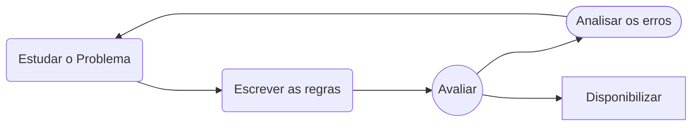
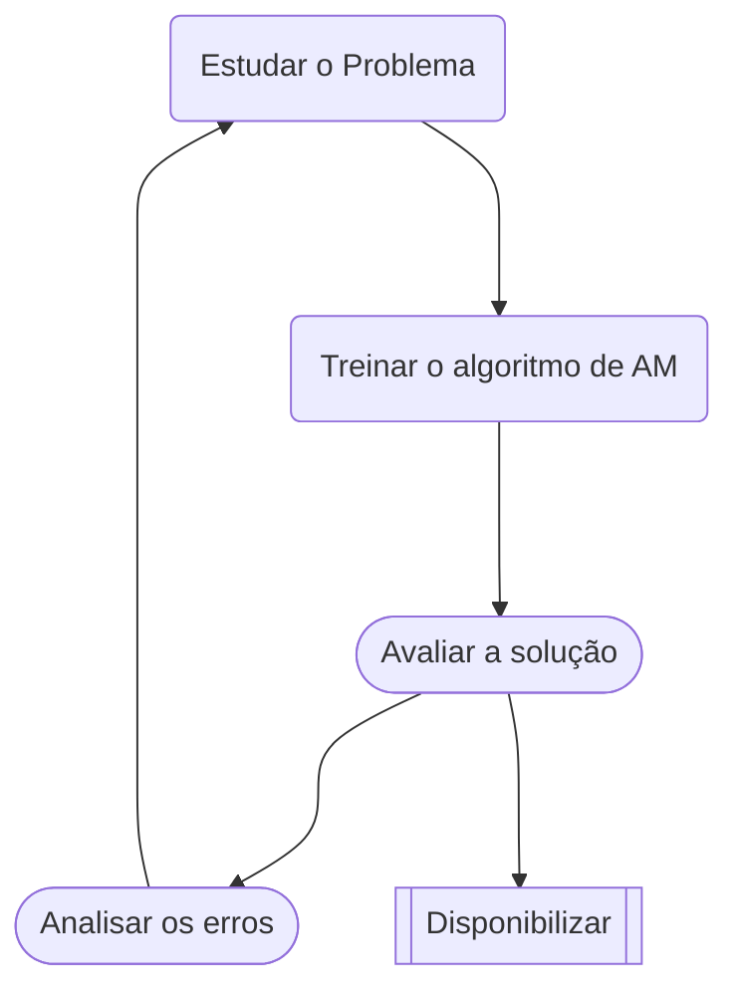

# Capítulo 1 : Cenário do Aprendizado de Máquina

Primeiro Algoritmo de Aprendizado de Máquina que se popularizou na década de 1999 , o foi *filtro de Spam* 

## 1.1 - O que é aprendizado de máquina?

* "Aprendizado de máquina é o campo de estudo que possibilita aos computadores a habilidade de de aprender sem explicitamente programa-los" , Arthur Samuel ,1959

## 1.2 - Por que usar Aprendizado de Máquina ?

##### **Desenvolvendo um filtro de spam nua abordagem tradicional**

1. Identificar as carecteristicas do spam, observando os padrões 

2. Escrever um algoritmo de detecção de spam para cada um dos padrões observados

3. Repertir o passos 1 e 2 até obter um bom desempenho

**Contras** :

* Se o problema for muito complexo o algoritmo também se tornará complexo, além disso tornando a manutenção do mesmo custosa e nada fácil

##### Nua abordagem do aprendizado de máquina

1. Um filtro de spam baseado em técnicas de aprendizado de máquina aprende automaticamente quais são os padrões e bom indicadores de spam 

**Vantagem a abordagem tradicional** : 

* Programe bem menor 
* Fácil manutenção
* Adaptabilidade de ambientes : sistema de aprendizado de maquina podem se adaptar a novos dados

## 1.3 - Tipos de Aprendizado de Máquina

* Serem ou não treinado com supervisão visão humana

* Se podem ou não aprender gradativamente em tempo real

* Se funcionam simplesmente comparando novos pontos de dados com dados conhecidos, ou se detectam padrões em dados de treinamento

### Aprendizado Supervisionado

O conjunto de treinamento que você fornece ao algoritmo inclui as soluções desejadas , chamadas de rotulos

* **Classificação**

* **Regressão**
  
  * Prever valor numéricos alvo [**target**], dado um conjunto de caracteristicas [**features**]

### Aprendizado Não Supervisionado

Os dados da treinamento não são rotulados,os sistema tenta aprender sem um professor

* **Clusterização** 
  
  * é uma técnica em que o algoritmo tenta dividir o conjunto de dados em grupos ou clusters, com base em características similares

* **Detecção de anomalias ou novidades**

* **Visualização** 

* **redução de dimensionalidade**
  
  * É simplificar os dados sem perder muita informação. Para tal,voce pode fazer um merge de diversas características correlacionadas em uma

* **Aprendizado de regras por associação**
  
  * É descobrir relações interessante entre atributos
  
  * Este tipo de aprendizado visa encontrar padrões que indicam relações entre variáveis no conjunto de dados.

### Aprendizado semissupervisionado

São combinações de aprendizado supervisionado e não supervisionado

### Aprendizado por esforço

O sistema de aprendizado ,chamado de agente nesse contexto , pode assistir , selecionar e executar ações e obter recompensas em troca. Ele deve aprender sozinho qual e melhor estrategia (politica) para obter maior recompensas ao longo do tempo.

### Aprendizado em bach(por ciclo)

O sistema e capaz de aprender de forma incremental : deve ser treinado com todos dos dados disponíveis. O sistema e treinado , depois colocado em produção e roda sem aprender mais nada, só o  que aprendeu.

**Contras** :

* Se o for atualizar o sistema e preciso usar os dados novos e antigos para treina-los e disponibilizar, com isso pode ser computacionalmente caro se do dados forem grandes para cada atualização

### Aprendizado Online(incremental)

É possivel treinar o sistema incrementalmente , fornecendo as instancia de forma sequancial ,individual ou em pequenos grupos 

### Aprendizado baseado em instancia

O sistema aprende os exemplos por meio da memorização e depois generaliza em novos casos , ao empregar ma medida de similaridade a fim de compara-lo aos outros exemplos aprendidos 

### Aprendizado baseado em modelo

Enfatiza a utilização de casos específicos (exemplos) como base para fazer previsões. Os casos são compostos por instâncias (entradas) e as ações ou decisões associadas a essas instâncias. O sistema aprende a adaptar as decisões com base nos casos históricos.

## Principais desafios do aprendizado de máquina

### Sobreajuste(Overfiting)

Significa que o modelo funciona bem nos dados de treinamento , mas não generaliza tão bem

* Acontece quando o modelo é muito complexo em relação á quantidade e ao ruído dos dados de treinamento , soluções:
  
  1. Simplificar o modelo ao selecionar um com menos parametros, reduzindo o número de atributos nos dados de treinamento ou retringindo o modelo
  
  2. Coletar mais dados de treinamento
  
  3. Reduzir o Ruído nos dados de treinamento(remover outliers e corrigir error de outliers)
  
  

&nbsp;

